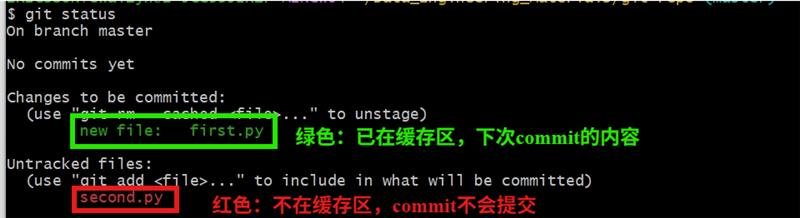
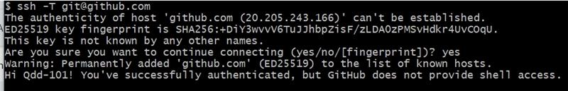
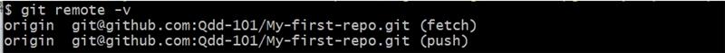
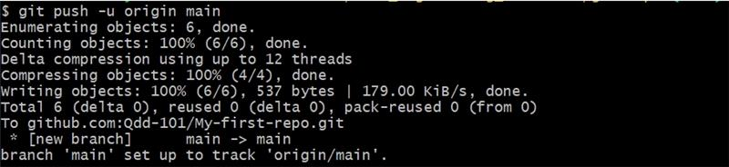

# Github Commands Notes

## Git Lifecycle
**工作区修改代码 → add → 加到暂存区 → commit → 推入本地仓库 → push → 推入远程仓库**  
3 basic git areas:  
Working directory: all files you create, change, etc, but haven't added or committed  
Staged directory: codes you git add  
Local repository: save committed codes, and you could push codes to remote repo

## Local Repo Actions:
- **git init**: create empty git repository (could use ls -la to check hidden files).  
  git init -b main (set branch name to 'main', cause default branch name is 'master')

- **git branch**: create new branch.  
  git branch -m master main: change branch name

- **git status**: check which branch you're on, check any files untracked, check tracked but uncommitted files, etc.  
- 

- **git add**: push codes in your working directory to staging area, prepared for commit.  
  git add . (push all newly created / modified / deleted files into staged area) (better set up .gitignore first)  
  - 删除已add内容：
  - **git reset**: delete all files in staged area (all become red fiels)
  - **git restore --staged xxx-file**: only delete certain file in the staged area (如果不加--staged参数，会直接用local repository里的文件覆盖本地文件！)
- **git diff**: check difference between files in your working directory (haven’t git add) and files in your staging area (your last git add codes)
- **git commit**: save codes in your staging area to local repository.  
  git commit -m "your commit message"

- **git log**: check all commits in your local repository.
  - 回退到某个版本: **git reset --hard 该版本的commit id**
  - 撤回commit的部分文件:
  1. Undo the entire commit:  
      - **git reset --soft HEAD~1**: (restore the whole commit, but your code changes still stay, and ready for next commit), all files are still green
  2. Remove specific file from commit:
      - **git restore --staged file1 file2 file3**: 3 files are red, the rest are green, ready for next commit
  3. Commit the rest files again:
      - **git commit -m "commit right files"**

- **git pull**: pull codes from remote repository to local repository.
- **git push**: push codes from local repository to remote repository.
  
## Push to Remote Repo

- **添加用户邮箱和用户名**:  
  On your local machine, run:
  - git config --global user.email "your-email". If you want to use github-noreply email:  
      - git config --global user.email your-github-noreply.com.  (check here: https://github.com/settings/emails)
  - git config --global user.name "your-name"
  
- **关联本地machine和Github Account**  
  1. 在本地创建ssh密钥:  
  **ssh-keygen -t ed25519 -C your-github-used-email**  
  2. 获取密钥内容:  
  **cat ~/.ssh/id_ed25519.pub**  
  3. 将密钥内容复制到Github的SSH Keys中，在本地检查是否关联成功:  
  **ssh -T git@github.com**  
  - 

- **将本地仓库与云端连接**  
  - **git remote add origin git@github.com:your-github-username/yout-repo-name.git**  
  origin: 将远端仓库别名设置为origin

  - **git remote -v**: 检查是否关联成功
  - 

- **将本地仓库推送到云端**  
  - **git push -u origin main**  
  main: 指本地仓库的main分支，如果本地仓库想推送feature1分支，就填feature1  
  origin: 远端仓库别名  
  -u: 建立映射 一般第一次推送远端时会加-u参数，后续在继续推送此branch就不用加了，git会自动识别  
  - 

- **如何推送其他分支**:  
  1. 先切换分支，再推送:
    - **git checkout new-feature**: 切换到分支new-feature  
    - **git push -u origin new-feature**: (第一次推送该分支加上-u参数，以后准备推送时，可直接写git push)
- **检查远程关联状况**:  
  **git branch -vv**: 查看当前分支的远程分支关联情况

- **删除远程仓库关联**:  
  **git remote rm origin**: 删除远程仓库关联
  
  
  
  
